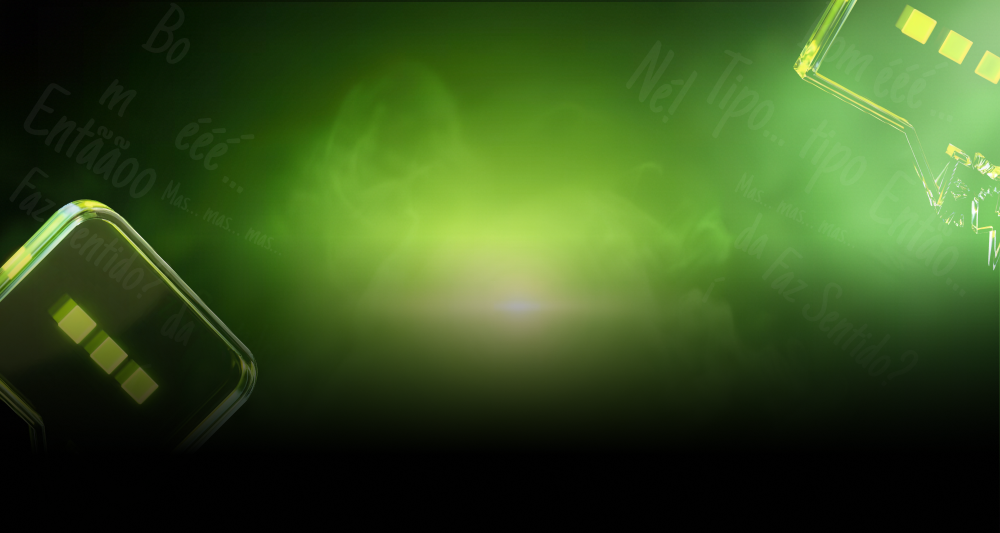

# Fale Sem Vício - Landing Page 🎙️

Uma landing page de alta conversão desenvolvida para o especialista **Giovanni Begossi (El Professor)**, focada em ajudar profissionais a eliminarem vícios de linguagem e dominarem a comunicação.

 _(Snapshot placeholder da primeira dobra)_

## 🚀 Tecnologias

Este projeto foi construído utilizando as tecnologias mais modernas do ecossistema React:

-   **React + TypeScript**: Base sólida e tipagem segura.
-   **Vite**: Build tool extremamente rápida para desenvolvimento.
-   **Tailwind CSS v4**: Estilização moderna e utilitária.
-   **Framer Motion**: Animações de entrada e interações fluidas.
-   **GSAP**: Controle preciso para animações complexas de texto.
-   **React Bits**: Componentes de UI curados para efeitos visuais premium.

## ✨ Funcionalidades (Dobra 01: Hero)

-   **Pixel-Perfect Fidelity**: Implementação rigorosa baseada no design do Figma, respeitando dimensões, espaçamentos e hierarquia visual.
-   **Background Animado (TextType)**: Efeito de digitação que cicla entre os principais vícios de linguagem ("ÉÉÉÉÉ!", "ENTÃO...", "faz sentido?", "TIPO... TIPO").
-   **Headline Dinâmica (BlurText)**: Animação de entrada suave com efeito de desfoque (Blur) para captar a atenção do usuário imediatamente.
-   **CTA Animado**: Botão de chamada para ação com entrada programada e efeitos de hover.
-   **Performance de Imagem**: Assets processados e servidos localmente para garantir carregamento instantâneo.
-   **Responsividade Full**: Layout adaptado para diferentes tamanhos de tela (Desktop, Laptop, Mobile), garantindo que todo o conteúdo da Hero caiba no viewport (100vh).

## 🛠️ Instalação e Uso

1.  **Clone o repositório**:
    ```bash
    git clone [url-do-repositorio]
    ```

2.  **Instale as dependências**:
    ```bash
    npm install
    ```

3.  **Inicie o servidor de desenvolvimento**:
    ```bash
    npm run dev
    ```

## 📁 Estrutura de Pastas Úteis

-   `src/components/sections`: Seções principais da página (Hero, etc).
-   `src/components/ui`: Componentes de interface e animações reutilizáveis (`BlurText`, `TextType`).
-   `public/assets`: Imagens, ícones e máscaras otimizadas.

## ✒️ Autor

Desenvolvido com foco em excelência visual e performance por **Antigravity**.
